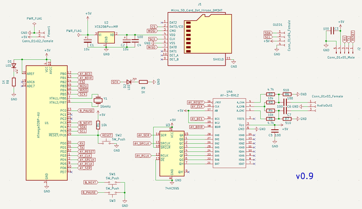
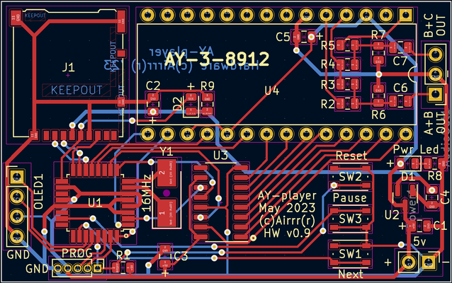
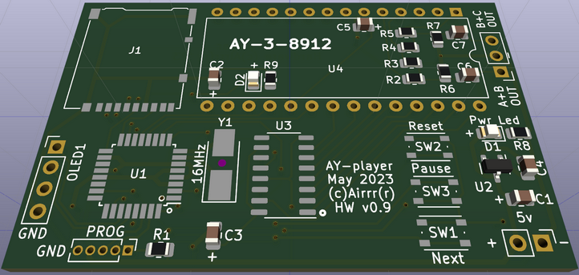
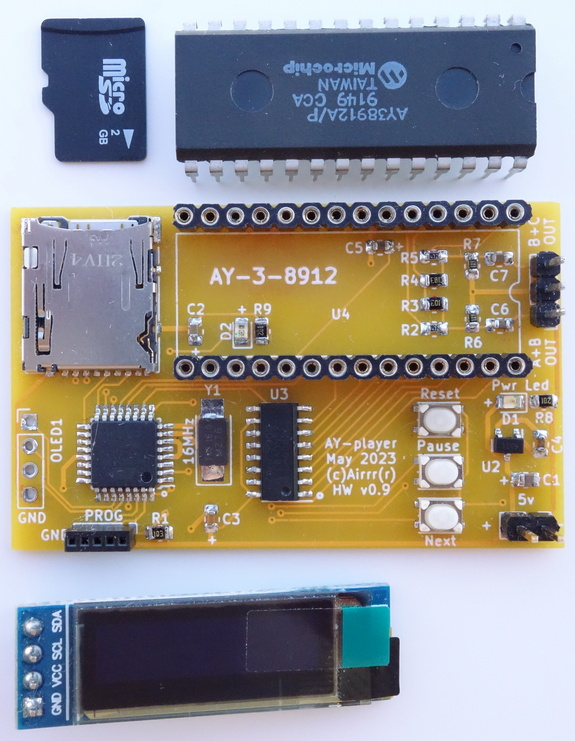
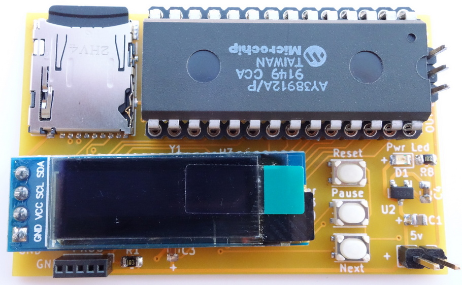
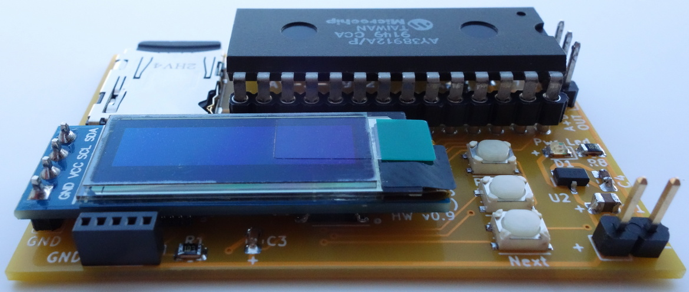
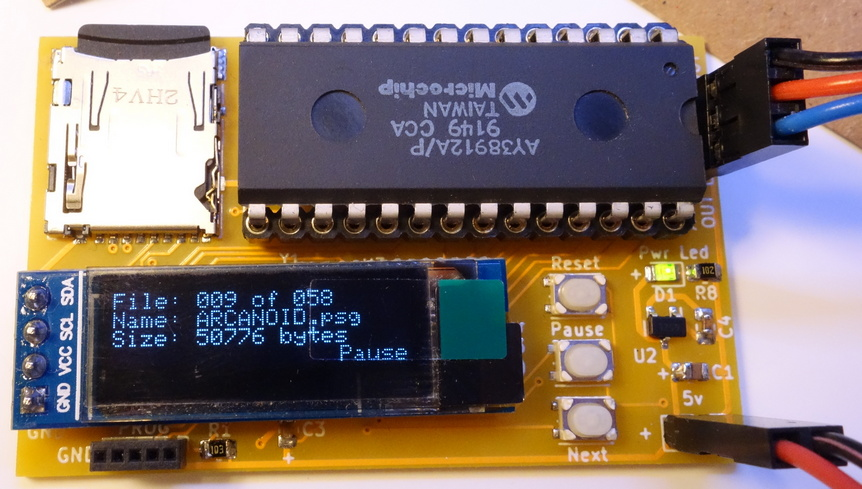

# AY-3-8912 psg music player.  
**Based on code https://gist.github.com/anteo/0e5d8867df7568a6523d54e19983d8e0  **
  
  
Board version 0.9:  
Test version limitations: external 5v supply, no battery, no amp.  
  
  
- ATmega328p-au, TQFP.  
- 16mHz quartz, 5.0x3.2mm.  
- 74HC595, SO-16, 3.9x9.9mm, P1.27.  
- SD holder, hirose DM3AT.  
- XC6206 3.3v, SOT-23.  
- Some Rs, Cs and LEDs, 0805.  
- Buttons, wuerth 434133025816.  
- Programming pinheader, 5 pins, P1.27.  
- SSD1306 OLED.  
    
*The cpu must be flashed at least with Arduino bootloader before soldering or with provided hex file.  
  
Many thanks to "Anteo" for his code. I just added oled support and a pause button.  
   
Just some photos here.  

